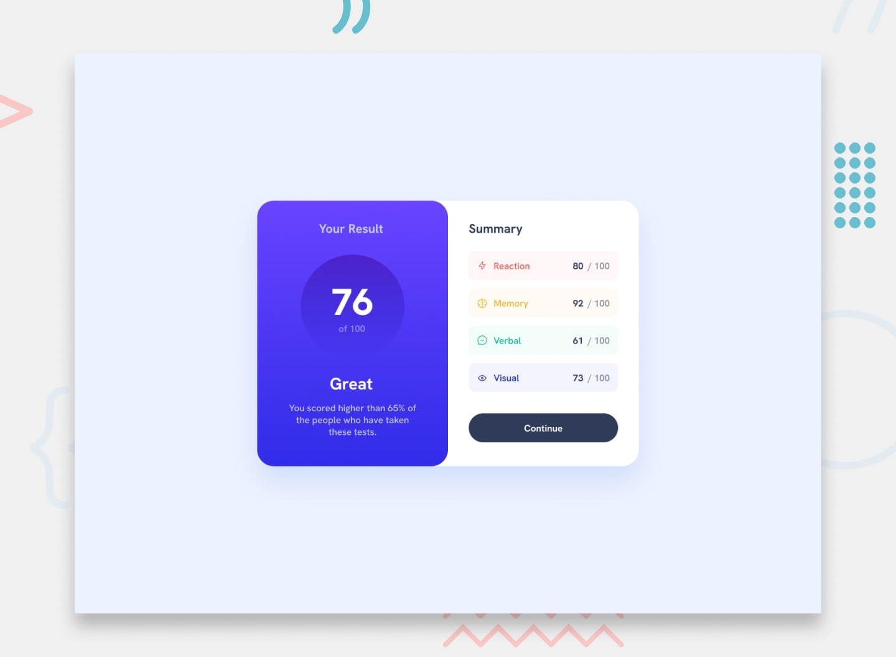

# Results Summary Component — Frontend Mentor Challenge


A solution to the [Results Summary Component challenge on Frontend Mentor](https://www.frontendmentor.io/challenges/results-summary-component-CE_K6s0maV). This challenge involves building a two-panel UI card that displays a user's overall result score alongside a detailed category breakdown.

---

## 📸 Preview



---

## Built With

- Semantic **HTML5** markup
- **CSS3** custom properties (variables)
- **Flexbox** for two-panel layout
- **Mobile-first** responsive workflow
- **JSON data** (`data.json`) to dynamically populate summary scores
- Google Fonts — *Hanken Grotesk*

---

## What's On The Page

- **Result Panel (left)** — Gradient purple card showing the overall score (76/100) with a rank label ("Great") and a percentile message
- **Summary Panel (right)** — Four category rows (Reaction, Memory, Verbal, Visual), each with a unique icon, color-coded label, and individual score out of 100
- **Continue Button** — Dark pill-shaped CTA button at the bottom of the summary panel

---

## What I Learned

- How to use a **`data.json`** file to drive dynamic content and keep HTML clean
- Applying **CSS linear gradients** for the result panel background
- Using **CSS custom properties** for color-coded category theming (red, yellow, green, blue)
- Structuring a **two-panel card layout** with Flexbox that collapses gracefully on mobile
- Creating a polished **pill button** with hover states using pure CSS

---

## Continued Development

In future projects, I want to:
- Use **JavaScript** to fetch and render `data.json` dynamically instead of hardcoding values
- Experiment with **CSS Grid** for more complex card layouts
- Add **transition animations** when scores load in for a more engaging experience

---

## Project Structure

```
results-summary-component/
├── assets/
├── design/
├── index.html
├── style.css
├── data.json
├── style-guide.md
├── preview.jpg
├── README.md
├── README-template.md
├── .gitignore
└── .gitattributes
```
---

## Acknowledgments

Challenge designed by [Frontend Mentor](https://www.frontendmentor.io). Solution coded by **Hazelle Jane A.**
